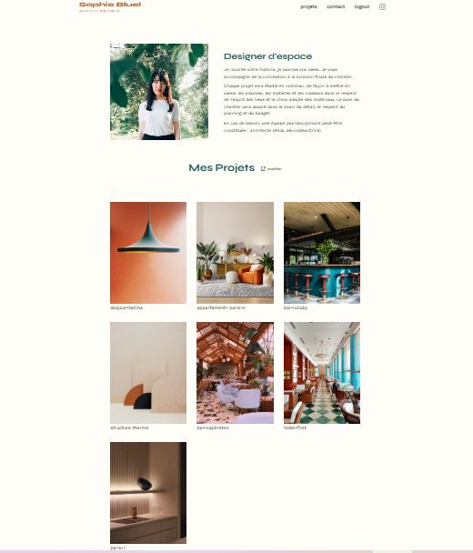

# Projet-03: Portfolio Architecte - Sophie Bluel

Ce projet est un site web dynamique de type portfolio, conçu pour une architecte d’intérieur. Il a été réalisé dans le cadre de ma formation de Développeur Web chez OpenClassrooms.

# Fonctionnalités:

-  Affichage dynamique des projets et de leurs catégories depuis une API
-  Filtrage par catégories
-  Authentification administrateur
-  Page de connexion
-  Modale pour suppression et ajout de projets
-  Manipulation de projets via l'interface admin
-  Communication avec une API REST sécurisée (token JWT)

#  Technologies:

- HTML5 / CSS3
- JavaScript (modulaire, `ES6+`)
- API REST (CRUD)
- DOM manipulation

# Structure du projet:

├── css/
│ ├── addModal.css
│ ├── deleteModal.css
│ ├── login.css
│ └── style.css
├── icons
├── images
├── js/
│ ├── main.js
│ ├── login.js
│ ├── docModals.js
│ └── sendData.js
├── index.html
└── login.html

# Connexion admin:

> Pour tester les fonctionnalités d'admin :

- Email : `sophie.bluel@test.tld`
- Mot de passe : `S0phie`  
(ou données fournies par le back-end)

---

# Installation & Lancement:

1. Cloner ce repo
2. Lancer le backend fourni par OpenClassrooms => (voir le README dans le dossier backend)
3. Ouvrir `index.html` dans un navigateur
4. Se connecter via `/login.html` pour débloquer les fonctions admin

---

# Capture d’écran:

---

# Licence:

Projet réalisé à but pédagogique — OpenClassrooms.